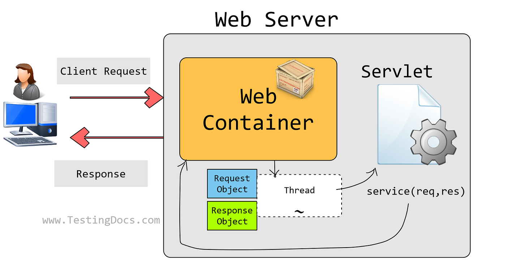
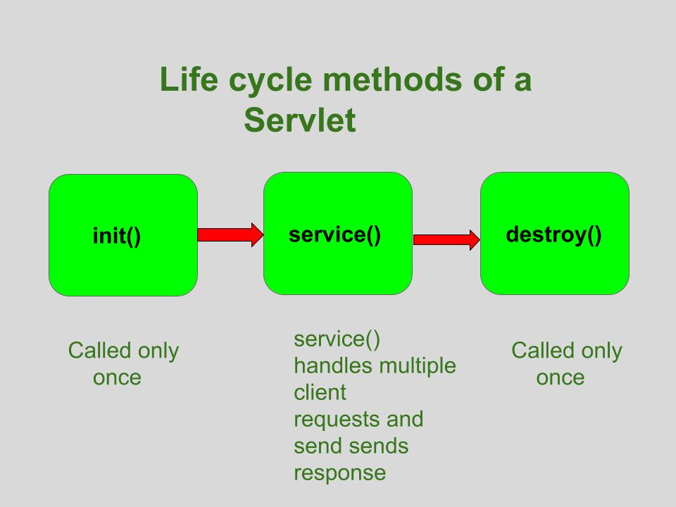
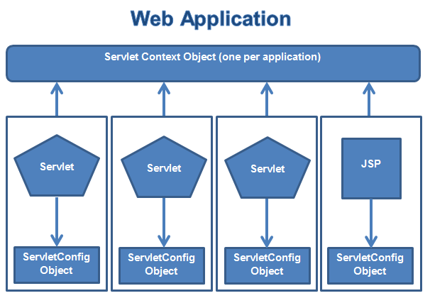

# Servlet_JSP
# Working of a Servlet


# Servlet Lifecycle Methods


# ServletContext VS ServletConfig


# Servlet Annotations
## Annotations can replace equivalent XML configuration in the web deployment descriptor file (web.xml) such as servlet declaration and servlet mapping. Servlet containers will process the annotated classes at deployment time.

```java
package com.example;

import java.io.IOException;
import javax.servlet.RequestDispatcher;
import javax.servlet.ServletException;
import javax.servlet.annotation.WebServlet;
import javax.servlet.http.Cookie;
import javax.servlet.http.HttpServlet;
import javax.servlet.http.HttpServletRequest;
import javax.servlet.http.HttpServletResponse;
import javax.servlet.http.HttpSession;
@WebServlet("/add")
public class AddServlet extends HttpServlet {
    public void doGet(HttpServletRequest req, HttpServletResponse res) throws IOException, ServletException {
        int i = Integer.parseInt(req.getParameter("num1"));
        int j = Integer.parseInt(req.getParameter("num2"));
        int k = i + j;
        Cookie cookie=new Cookie("k",k+"");
        res.addCookie(cookie);
        res.sendRedirect("sq");
    }
}
```